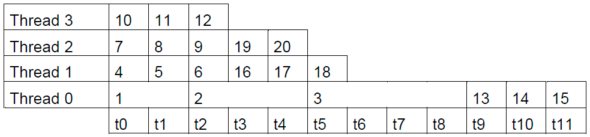

*Correção: OK. 2,0 pontos pelo atraso.*
# Atividade 02

### Questão 01

Considerando o código:
```
double **mtxMul (double **c, double **a, double **b, int n) {
   for (int i = 0; i < n; i++)
       for (int j = 0; j < n; j++) {
            c[i][j] = 0.0;
            for (int k = 0; k < n; k++)
                c[i][j] = c[i][j] + a[i][k] * b[k][j];
        }
   return c;
}
```
1. Quando apenas o laço for externo é paralelizado a quantidade de operações realizadas pelo laço for mais interno (quantidade de produtos escalares), em tese, seria 125000, entretanto como a divisão do n = 100 por 8 threads é um valor fracionário 4 núcleos executam 130000 e outros 4 núcleos executam 120000, somando assim as 1000000 operações. Ou seja faz-se uma divisão desbalanceada. *Correção: OK*
2. Com a aplicação da diretiva _'collapse(2)'_ no laço mais externo, dividem-se a soma das interações do laço for mais externo e o segundo mais externo pelo número de threads, portanto temos 10000 interações divididas sequencialmente por 8, possuindo um resultado exato. Nesse caso, nota-se uma divisão balanceada do trabalho, fazendo com que cada um dos 8 threads realize 125000 operações. *Correção: OK*
3. Ativando as regiões paralelas aninhadas e com _'OMP_NUM_THREADS=2,4'_ temos uma situação semelhante ao item 1.2, pois também temos uma divisão balanceada com cada thread executando 125000 operações, entretanto se diferencia em como as divisões são feitas. Nesse caso, cada thread recebe alguns pequenos lotes (não sequenciais) que somados equivalem as 125000 operações no laço for mais interno.*Correção: OK, poderia ter explicado um pouco melhor para cada nível, mas o valor está correto.*

### Questão 02

A partir do programa:

```
#include <stdio.h>
#include <unistd.h>
#include <omp.h>

int main(int argc, char *argv[]){
    int max;
    sscanf(argv[1], "%d", &max);
    long int sum = 0;
#pragma omp parallel for reduction(+:sum) schedule(runtime)
    for (int i = 1; i <= max; i++){
        printf("%2d @ %d\n", i, omp_get_thread_num());
        sleep(i < 4 ? i + 1 : 1);
        sum = sum + i;
    }
    printf("%ld\n", sum);
    return 0;
}
```
 Supondo que o programa está em execução com 4 threads e o valor fornecido para max foi 20. As iteraçôes executada por suas respectivas threads de acordo com a diretiva para escalonamento utilizada estão descritos abaixo:

**1.** Caso seja utilizada a diretiva _'static,num_chunk'_, a quantidade de chunks de tamanho _'num_chunk'_ é alocada de forma estática para cada thread, no qual cada thread tem de executar chunks predefinidos.
- Para _'static,1'_:
<div>
    <center>
    
</div>

- Para _'static,2'_: 
<div>
    <center>
    
</div>

- Para _'static,3'_:
<div>
    <center>
    
</div>

*Correção: Ok, fez round-robin com partições de acordo com o tamanho do chunk*.

**2.** Caso seja utilizada a diretiva _'dynamic,num_chunk'_, a quantidade de chunks de tamanho _'num_chunk'_ é alocada de forma dinamica para a quantidade de threads de forma sequencial, na qual quando uma thread fica ociosa, ela aloca o proximo chunk da fila, até que não existam mais chunks para serem computados.
- Para _'dynamic,1'_:
<div>
    <center>
    
</div>

- Para _'dynamic,2'_:
<div>
    <center>
    
</div>

- Para _'dynamic,3'_:
<div>
    <center>
    
</div>
   
 *Correção: Ok, mostrou o equilíbrio maior.*.

